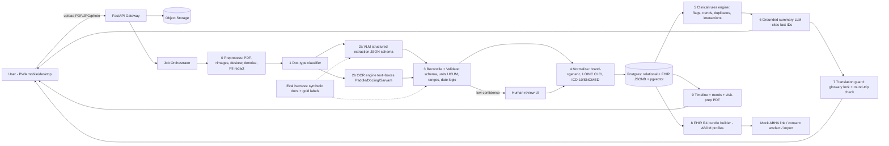

# 02 — ARCHITECTURE, PIPELINE, DATA MODEL

## 1. Recommended stack (optimised for a 22-hour build + a deployed link)
- **Frontend:** Next.js (App Router) + TypeScript + Tailwind + shadcn/ui, built as a **mobile-first PWA**. Charts: Recharts. Fonts: Noto Sans Telugu / Devanagari. Dark mode.
- **Backend:** Python FastAPI (async) + Pydantic v2. Background jobs: FastAPI BackgroundTasks (upgrade to Celery/RQ only if time).
- **DB/Storage/Auth:** Supabase (Postgres + JSONB + pgvector + Storage + Auth) — or plain Postgres + S3-compatible storage if Supabase is not allowed.
- **AI (API-first, no self-hosted GPU):**
  - Primary extractor: a Gemini multimodal model via Google AI Studio API with **JSON-schema constrained output**, temperature 0.
  - Second opinion / OCR text: PaddleOCR (CPU) or Docling for text + boxes; optional Sarvam Vision API for Indic/handwritten pages.
  - Optional medical-tuned model: MedGemma 1.5 4B (lab-report-to-JSON capability) via Hugging Face / Vertex if a GPU endpoint is free; treat as a bonus, not a dependency.
  - Summaries/explanations: Gemini text model, grounded on structured facts only.
  - Translation: IndicTrans2 (self-host is heavy) → use Sarvam-Translate API, Bhashini API, or Gemini with a glossary lock + round-trip check.
- **FHIR:** `fhir.resources` (Python, R4) to build/validate; HAPI FHIR public validator or `hl7.fhir` validator jar for a CI check.
- **Privacy:** Microsoft Presidio (or regex + NER) to redact names/phones/IDs **before** any third-party LLM call; re-hydrate after.
- **Deploy:** Frontend → Vercel; backend → Render / Railway / Cloud Run (or Nimbus by byteXL — the rulebook says it supplies the env and encourages using it; check whether your challenge requires it). Keep a free-tier cold-start warmup ping.

## 2. System diagram (draw this in draw.io/Excalidraw/Mermaid for the deliverable)


## 3. Pipeline stage contracts
| Stage | Input → Output | Rules |
|---|---|---|
| 0 Preprocess | file → page images (+ text layer if digital PDF) | If PDF has a text layer, use it as extra evidence. Deskew/denoise phone photos. Strip/redact PII for the LLM copy only. |
| 1 Classify | pages → `prescription / lab_report / discharge_summary / imaging_report / other` + language(s) | Cheap prompt; also detect scripts (Telugu/Hindi/English) |
| 2a VLM extract | pages → JSON per schema §5 | Temperature 0, `response_schema`, one retry on invalid JSON. Ask for `confidence` + `source_quote` per field. |
| 2b OCR | pages → text lines + bboxes | Used for (i) cross-check numeric values, (ii) bbox for evidence highlight |
| 3 Reconcile/Validate | 2a+2b → validated facts | Value present in OCR text? Unit plausible? Date valid and ≤ today? Frequency parsed (OD/BD/TDS/1-0-1)? Mismatch → `needs_review=true`. |
| 4 Normalise | facts → coded facts | Medicine brand → generic via Indian medicine dataset (fuzzy match, rapidfuzz); test name → LOINC via CLCI CSV; diagnosis → ICD-10 (lookup list) — store `code`, `system`, `match_score`. Unmatched stays free-text. |
| 5 Rules engine | observations → flags | Use report's printed range first, else seeded table (age/sex). Output `H/L/critical/normal/unknown`. Trend = delta vs previous same-LOINC value. Duplicate therapy = same generic from ≥2 active meds. Interactions = small curated JSON for demo + "verify with pharmacist" label. |
| 6 Summary | flagged facts → plain-language text | Prompt receives ONLY structured facts with IDs. Output: `{sections:[{text, fact_ids[]}]}`. Reading level ~Grade 6–8. No diagnosis, no dose changes. Always add "talk to your doctor" for abnormal/critical. |
| 7 Translate | summary → te/hi | Replace drug names/numbers/units with `{{F12}}` placeholders → translate → restore → round-trip back to English and compare numbers; mismatch → fall back to English + notice. |
| 8 FHIR | DB → Bundle(type=document) | Map to ABDM profiles (§6). Validate in CI. |
| 9 Timeline | DB → UI | Chronological events: encounters, reports, med start/stop, abnormal flags; trend charts per LOINC. |

## 4. Relational schema (Postgres) — design so every row maps to a FHIR resource
```sql
-- identity & consent
create table person (id uuid pk, owner_user_id uuid, display_name text, relationship text check (relationship in ('self','parent','child','spouse','other')),
  dob date, sex text, abha_number text null, abha_address text null, created_at timestamptz default now());     -- FHIR Patient
create table consent (id uuid pk, person_id uuid, purpose text, scope text[], granted_at timestamptz, expires_at timestamptz, revoked_at timestamptz null); -- FHIR Consent (ABDM artefact style)
create table audit_log (id bigserial pk, actor uuid, action text, entity text, entity_id uuid, at timestamptz default now(), meta jsonb);

-- documents & extraction
create table document (id uuid pk, person_id uuid, doc_type text, language text[], storage_path text, sha256 text, doc_date date, facility text, clinician text,
  status text check (status in ('uploaded','processing','needs_review','ready','failed')), created_at timestamptz default now()); -- FHIR DocumentReference
create table extraction_run (id uuid pk, document_id uuid, model text, prompt_version text, raw_json jsonb, ocr_text text, latency_ms int, created_at timestamptz default now());
create table encounter (id uuid pk, person_id uuid, document_id uuid, date date, facility text, clinician text, reason text);  -- FHIR Encounter

-- clinical facts (each has provenance)
create table observation (id uuid pk, person_id uuid, document_id uuid, encounter_id uuid null, name_raw text, loinc_code text null, value_num numeric null, value_text text null,
  unit text, ref_low numeric null, ref_high numeric null, ref_text text null, flag text, effective_date date,
  confidence real, needs_review bool default false, verified_by_user bool default false, source_page int, bbox jsonb null);           -- FHIR Observation
create table medication (id uuid pk, person_id uuid, document_id uuid, brand_raw text, generic_name text null, strength text, form text, route text,
  dose_text text, frequency_code text, timing text, duration_days int null, start_date date, end_date date null, status text, instructions text,
  confidence real, needs_review bool, verified_by_user bool, source_page int, bbox jsonb null);                                       -- FHIR MedicationRequest
create table condition (id uuid pk, person_id uuid, document_id uuid, text text, icd10 text null, snomed text null, onset_date date null, clinical_status text,
  confidence real, needs_review bool, source_page int);                                                                               -- FHIR Condition
create table allergy (id uuid pk, person_id uuid, substance text, reaction text null);                                                -- FHIR AllergyIntolerance

-- outputs
create table summary (id uuid pk, document_id uuid, lang text, sections jsonb, model text, created_at timestamptz default now()); -- sections[].fact_ids[] = citations
create table fhir_bundle (id uuid pk, person_id uuid, document_id uuid, profile text, bundle jsonb, validated bool, created_at timestamptz default now());
create table chunk (id uuid pk, person_id uuid, document_id uuid, text text, embedding vector(768));                                    -- grounded Q&A over own records
create table eval_case (id uuid pk, doc_ref text, gold jsonb, pred jsonb, metrics jsonb, run_at timestamptz default now());
```
Row-level security: every table filtered by `owner_user_id` through `person`.

## 5. Extraction JSON schema (what the VLM must return)
```json
{
  "doc_type": "prescription|lab_report|discharge_summary|imaging_report|other",
  "languages": ["en","te"],
  "document_date": "YYYY-MM-DD|null",
  "facility": {"value": "", "confidence": 0.0},
  "clinician": {"value": "", "registration_no": null, "confidence": 0.0},
  "patient": {"name": null, "age": null, "sex": null},
  "diagnoses": [{"text": "", "icd10_hint": null, "confidence": 0.0, "source_quote": ""}],
  "medications": [{"brand": "", "generic_hint": null, "strength": "", "form": "", "route": "",
     "dose": "", "frequency": "", "frequency_code": "OD|BD|TDS|QID|HS|SOS|custom", "timing": "before_food|after_food|null",
     "duration": "", "instructions": "", "confidence": 0.0, "source_quote": "", "page": 1}],
  "observations": [{"name": "", "value": "", "unit": "", "ref_range": "", "printed_flag": "H|L|null",
     "confidence": 0.0, "source_quote": "", "page": 1}],
  "procedures_imaging": [{"text": "", "impression": "", "confidence": 0.0}],
  "follow_up": {"date": null, "instructions": ""},
  "warnings": ["illegible region on page 2 line 4"]
}
```
Rules: never guess an unreadable value → return `null` + a warning. Preserve original script text in `source_quote`.

## 6. ABDM / FHIR mapping (decide now; it shapes the schema)
- Use the NRCeS "FHIR Implementation Guide for ABDM" (FHIR R4). Document profiles are all based on `Composition`: **PrescriptionRecord, DiagnosticReportRecord, DischargeSummaryRecord, HealthDocumentRecord** (also ImmunizationRecord, InvoiceRecord, WellnessRecord, OPConsultRecord).
- Bundle = `Bundle(type=document)` whose first entry is the `Composition`, followed by Patient, Practitioner, Organization, Encounter, and section entries.
  - Prescription → Composition(PrescriptionRecord) + `MedicationRequest[]` + `Condition[]` (+ Binary of the scanned original)
  - Lab → Composition(DiagnosticReportRecord) + `DiagnosticReport` + `Observation[]` (LOINC from CLCI)
  - Discharge → Composition(DischargeSummaryRecord) + Encounter + Condition + MedicationRequest + Procedure + DocumentReference
  - Unstructured upload → Composition(HealthDocumentRecord) + DocumentReference/Binary
- Always set `meta.profile` to the official `https://nrces.in/ndhm/fhir/r4/StructureDefinition/...` URL, and validate. Download the IG package/examples from the NRCeS site and use the published example bundles as test fixtures.
- **Mock ABHA:** fields `abha_number` (14-digit format) & `abha_address` (`name@abdm`). Endpoints: `POST /abha/mock/link` (OTP always `123456`), `POST /abha/mock/import` (loads a canned FHIR bundle into the timeline as an external-provider record), `POST /consent/grant` (creates Consent artefact; export endpoint refuses without active consent). Clearly label "MOCK — no real Aadhaar/ABHA data used". Real sandbox integration is milestone-based (M1 ABHA, M2 HIP sharing, M3 HIU fetching) and needs registration — out of scope for 24 h; the NHA ABDM-wrapper repo has a mock gateway to reference in the "future work" slide.

## 7. API surface (FastAPI)
```
POST /api/persons                      GET /api/persons/{id}/profile
POST /api/documents (multipart)        GET /api/documents/{id}            (status polling / SSE)
GET  /api/documents/{id}/facts         PATCH /api/facts/{type}/{id}       (user verify/correct)
GET  /api/persons/{id}/timeline        GET /api/persons/{id}/trends?loinc=
GET  /api/documents/{id}/summary?lang=en|te|hi
POST /api/persons/{id}/ask             (grounded Q&A, returns citations; refuses diagnosis/dosing)
GET  /api/documents/{id}/fhir          GET /api/persons/{id}/fhir-bundle
POST /api/abha/mock/link  POST /api/abha/mock/import  POST /api/consent/grant
GET  /api/persons/{id}/visit-prep.pdf  GET /api/persons/{id}/meds.ics
POST /api/eval/run                     GET /api/health
```

## 8. Prompts (store in /backend/prompts/, version them)
- `classify_v1`, `extract_v1` (system: "You are a clinical data extraction specialist… return ONLY JSON matching schema… never infer unreadable values… preserve Telugu/Hindi source text"), `summarize_v1` (grounded; cite fact_ids; reading level; forbidden: diagnosis, dose change, "you have <disease>"), `ask_v1` (answer only from provided chunks/facts, else "not found in your records"), `translate_v1` (placeholders locked).
- Safety post-filter: regex/LLM-judge rejects outputs containing diagnostic claims ("you have…", "start/stop/increase … mg").

## 9. Safety & healthcare-impact checklist (judged at 10%)
- Disclaimer on every summary screen + footer: "Informational only. Not medical advice. Discuss with your doctor."
- Critical-value banner (code-driven) with urgent-care wording; no home-treatment advice.
- Show uncertainty: confidence chips, "please verify against the original".
- No dose recommendations; medicine info is "what this medicine is generally used for" (from the dataset), not advice.
- Data: synthetic demo data only; encryption at rest; signed URLs; delete-my-data button; audit log.
